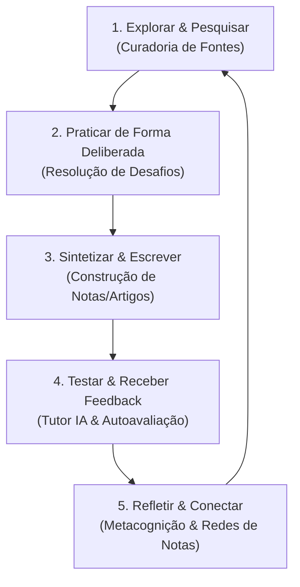

# 🧠 Filosofia de Aprendizagem (LEARNING_PHILOSOPHY.md)

O **DSE.LearnLab** não é apenas um software educacional; ele é um **produto baseado em evidências científicas de aprendizagem**. Esta filosofia define os princípios que orientam o design das nossas funcionalidades, a arquitetura do nosso sistema e a experiência de quem utiliza a plataforma.

Nossa missão é mover o estudante de um papel de **consumidor passivo** (que apenas assiste a vídeos ou lê slides) para o papel de **produtor ativo** (que pratica, escreve, pesquisa e constrói conhecimento concreto).

---

## 🏛️ Os Pilares Científicos da Plataforma

Nossa fundação teórica é construída sobre as pesquisas e conceitos de renomados cientistas e especialistas da aprendizagem, como **Anders Ericsson** (especialista em expertise e prática deliberada), **Barbara Oakley** (neurociência do aprendizado) e **Scott Young** (aprendizado autodirigido e ultra-aprendizado).

### 1. Aprendizagem Autodirigida (Self-Directed Learning)
Acreditamos que o aprendizado mais profundo e duradouro ocorre quando o estudante assume o controle de sua jornada.
* **Metacognição**: A capacidade de monitorar, avaliar e ajustar o próprio processo de pensamento. A plataforma fornece ferramentas para que o estudante planeje seus estudos, avalie seu próprio nível de compreensão e ajuste suas estratégias.
* **Autoeficácia**: Construída por meio de pequenas vitórias diárias e registro de progresso real, permitindo que o estudante ganhe confiança em sua capacidade de dominar assuntos complexos.

### 2. Prática Deliberada (Deliberate Practice)
Conceituada por *Anders Ericsson*, a prática deliberada é o oposto da repetição irracional. Ela exige:
* **Metas Claras e Específicas**: Em vez de "estudar Python por duas horas", a plataforma incentiva "escrever uma função que processe dados usando list comprehension e tratar 3 exceções específicas".
* **Foco Total (Deep Work)**: Sessões de estudo livres de distrações, focadas no limite da habilidade atual.
* **Feedback Imediato**: A plataforma automatiza o feedback por meio de testes de código, corretores de resumos baseados em IA e sistemas de autoavaliação guiada.
* **Saída da Zona de Conforto**: Identificação constante de lacunas de conhecimento e pontos fracos para que o estudante treine exatamente onde tem mais dificuldade.

### 3. Estudo Ativo e Técnicas de Fixação
* **Active Recall (Prática de Lembrança)**: Forçar o cérebro a recuperar informações da memória é muito mais eficiente do que reler passivamente. O DSE.LearnLab implementa isso por meio de geração inteligente de questões e flashcards.
* **Repetição Espaçada (Spaced Repetition)**: Algoritmos que calculam o momento ideal de revisão de um concept antes que ele seja esquecido.
* **Modos Focado e Difuso (*Barbara Oakley*)**: Alternar entre o foco intenso em um problema (modo focado) e períodos de descanso/distração controlada (modo difuso) para permitir a consolidação de redes neurais e a resolução criativa de problemas.
* **Técnica Feynman**: Explicar um conceito complexo com termos simples, como se estivesse ensinando a uma criança. A plataforma incentiva isso através da escrita de sínteses e da interação com o Tutor Socrático por IA.

### 4. Escrita & Síntese (Produção Intelectual)
A escrita é o espelho do pensamento. Quem não consegue explicar ou sintetizar um assunto por escrito provavelmente não o compreendeu em profundidade.
* **Construção de Artefatos**: Resumos, artigos, notas estruturadas e relatórios de pesquisa são tratados como subprodutos fundamentais do processo de aprendizado.
* **Notas Conectadas (Zettelkasten)**: Incentivamos a criação de uma rede de conhecimento pessoal, onde ideias novas se conectam a ideias anteriores, gerando insights originais.

### 5. Pesquisa & Evidências
A ciência de dados e o desenvolvimento profissional exigem a habilidade de consultar fontes primárias, ler artigos acadêmicos e gerenciar referências confiáveis.
* **Curadoria e Gestão de Fontes**: Facilitar a importação de referências de ferramentas como o Zotero e estimular o estudante a documentar a base bibliográfica que sustenta suas conclusões.

---

## 🛠️ Como Esses Princípios se Traduzem em Funcionalidades?

| Princípio Científico | Funcionalidade no DSE.LearnLab |
| :--- | :--- |
| **Prática Deliberada** | Sistema de Registro de Prática com definição de metas específicas, métricas de esforço e feedback de IA. |
| **Metacognição** | Dashboard de progresso, mapa de evolução de competências e autoavaliação pós-sessão. |
| **Active Recall / Feynman** | Geração automática de questões com base nas notas do aluno e o Tutor Socrático por IA. |
| **Escrita & Síntese** | Editor Markdown integrado para elaboração de notas e resumos acadêmicos/técnicos. |
| **Gestão de Fontes** | Gerenciador de referências bibliográficas com integração a bases de dados (Zotero, arXiv, etc.). |

---

## 🧭 O Ciclo de Aprendizagem DSE.LearnLab

Nossa interface e fluxo de trabalho guiam o estudante através de um ciclo contínuo:

> **"Aprender não é acumular páginas lidas ou vídeos assistidos. É sobre o que você é capaz de produzir, refletir e provar com base em evidências."**
