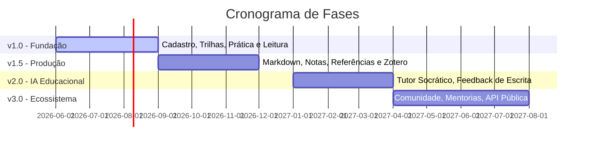

# 🗺️ Roadmap de Desenvolvimento (ROADMAP.md)

Este documento descreve o plano de evolução do **DSE.LearnLab** a curto, médio e longo prazo. Cada fase do roadmap foi projetada para construir blocos sólidos e integrados, baseando-se no aprendizado empírico dos estudantes e na sofisticação tecnológica da plataforma.

---

## 📍 Visão Geral das Fases

---

## 🚀 Detalhamento das Versões

### 1. v1.0 — Fundação (Foco em Hábito e Estruturação)
**Objetivo**: Estabelecer a infraestrutura básica da plataforma e permitir que o aluno crie rotinas de estudo ativas através do planejamento e acompanhamento da prática deliberada.

*   **⚙️ Backend & Plataforma**:
    *   API de Cadastro e autenticação de usuários (JWT).
    *   Arquitetura de persistência PostgreSQL.
*   **💻 Frontend & UX**:
    *   Interface responsiva com foco em navegação limpa (estilo "zen mode").
    *   Dashboard simples de progresso diário.
*   **📚 Ciência da Aprendizagem**:
    *   *Trilhas de Estudo*: Cadastro de tópicos estruturados com competências associadas.
    *   *Registro de Prática*: Tela para planejar a sessão de prática (definir a meta focada), registrar o tempo executado e responder ao checklist metacognitivo final.
    *   *Registro de Leitura*: Log simples de progresso de livros técnicos e artigos.

---

### 2. v1.5 — Produção (Foco em Escrita e Gestão de Fontes)
**Objetivo**: Adicionar a capacidade de gerar conhecimento estruturado através da escrita em Markdown e da pesquisa científica com referências bibliográficas robustas.

*   **✍️ Escrita & Produção Intelectual**:
    *   *Editor Markdown*: Editor rico com renderização em tempo real integrado à plataforma.
    *   *Sistema de Notas*: Notas conectadas (links bidirecionais entre notas para criação de redes de conhecimento pessoal).
    *   *Exportação*: Capacidade de exportar notas de estudo em formato PDF acadêmico estruturado.
*   **🔬 Pesquisa & Evidências**:
    *   *Gerenciador de Referências*: Armazenar e categorizar fontes de leitura (livros, artigos científicos, links).
    *   *Integração Zotero*: Sincronização automática das coleções do Zotero do estudante com a biblioteca do DSE.LearnLab.
    *   *Sistema de Citações*: Facilitador de citações formatadas (ABNT, APA) diretamente no editor de escrita.

---

### 3. v2.0 — IA Educacional (Foco em Feedback e Tutoria Inteligente)
**Objetivo**: Elevar a experiência de aprendizado utilizando IA generativa de ponta para fornecer correções de escrita em tempo real e guiar o estudante no estilo socrático.

*   **🤖 IA para Aprendizagem**:
    *   *Tutor Socrático*: Chatbot de IA que não dá respostas diretas, mas faz perguntas instigantes para guiar o estudante no processo de descoberta e resolução de problemas.
    *   *Corretor de Resumos & Feedback*: Avaliação automática da profundidade de sínteses de leitura em Markdown, gerando sugestões de melhoria gramatical e conceitual.
    *   *Geração de Questões*: Criação dinâmica de quizzes baseados em Active Recall (escolha múltipla ou abertas com avaliação de IA) a partir das notas pessoais do estudante.
*   **📊 Analytics Educacional**:
    *   *Mapa de Competências*: Visualização em gráfico de radar do domínio do estudante nas habilidades das trilhas estudadas.
    *   *Indicadores de Evolução*: Tempo de estudo ativo, taxa de acerto em revisões e quantidade de sínteses produzidas.

---

### 4. v3.0 — Ecossistema (Foco em Colaboração e Rede de Conhecimento)
**Objetivo**: Abrir a plataforma para a interação social, criando comunidades de aprendizagem coletiva e facilitando a mentoria entre pares.

*   *Comunidades de Estudo*: Espaços de discussão colaborativa em torno de trilhas de aprendizagem específicas, com compartilhamento público de resumos e notas de estudo (aprendizado social).
*   *Mentorias*: Sistema para pareamento automático de mentores e mentorados com base no Mapa de Competências de cada estudante (estudantes avançados ensinam iniciantes).
*   *Marketplace de Trilhas*: Permite que profissionais de educação e criadores publiquem suas próprias trilhas de estudo estruturadas com curadoria de referências e conjuntos de práticas sugeridos.
*   *API Pública*: Exposição de endpoints para integração de extensões externas e automações criadas pela própria comunidade.
